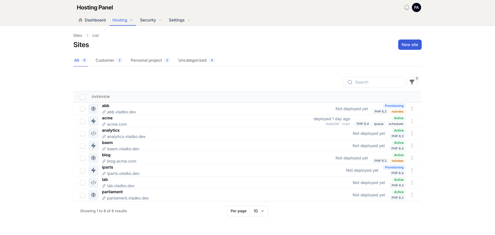

# Filament Tailscale Theme

A light, Tailscale-console-inspired overlay theme for the Filament v5 admin panel.

[](https://packagist.org/packages/vlados/filament-tailscale-theme)
[](https://packagist.org/packages/vlados/filament-tailscale-theme)
[](LICENSE.md)

A warm-neutral, airy light theme modeled on the Tailscale dashboard. It is an **overlay** — a plain stylesheet that loads on top of Filament's default theme and restyles the `.fi-*` components. There is no Tailwind build to set up and no theme to replace: install the package, publish the asset, register the plugin, and your panel takes on the Tailscale look.



## Requirements

- PHP `^8.2`
- Filament `^5.0`

The full header look (the two-row contained header) assumes your panel uses `->topNavigation()`.

## Installation

Install the package via Composer:

```bash
composer require vlados/filament-tailscale-theme
```

Then publish the theme's CSS asset:

```bash
php artisan filament:assets
```

> [!NOTE]
> Re-run `php artisan filament:assets` after every update to the package so the published stylesheet stays in sync.

## Usage

Register the plugin in your Panel provider:

```php
use Vlados\FilamentTailscaleTheme\FilamentTailscaleTheme;

public function panel(Panel $panel): Panel
{
    return $panel
        // ...
        ->plugins([
            FilamentTailscaleTheme::make(),
        ]);
}
```

That's all that is required — the theme is active on the next page load.

### Configuration

Both options are fluent and optional:

```php
use Filament\Support\Colors\Color;
use Vlados\FilamentTailscaleTheme\FilamentTailscaleTheme;

FilamentTailscaleTheme::make()
    ->primaryColor('#3b5bdb')        // or ->primaryColor(Color::Indigo)
    ->forceLightMode();              // pass false to leave the theme toggle free
```

| Method | Default | Description |
|--------|---------|-------------|
| `->primaryColor($color)` | Tailscale indigo `#3b5bdb` | Override the accent color. Accepts a hex string (e.g. `'#3b5bdb'`) or a Filament color array (e.g. `Color::Indigo`). |
| `->forceLightMode($force = true)` | `true` | Force the panel's default theme mode to Light. Pass `false` to leave the user's theme toggle free. |

## What it changes

The theme restyles Filament's components for a calm, console-like feel:

- A contained **two-row top header** on a full-width warm-gray band — brand and user actions on the first row, navigation tabs on the second with a blue active underline and rounded-top hover. (Requires `->topNavigation()`.)
- A white content canvas with tightened page-header spacing.
- **Minimalist, borderless tables**: uppercase muted column heads, hairline row dividers, compact ~44px rows, a subtle warm hover — no zebra striping, no card, no shadow.
- **Underline-style filter tabs** instead of a segmented pill.
- Hairline inputs with a 1px indigo focus ring, flattened hairline form sections, and calm section-header typography.
- Solid indigo primary CTAs, white-with-hairline secondary buttons, and solid-red danger buttons.
- Quiet metadata badges and soft dropdown/modal elevation.
- An indigo-blue accent (`#3b5bdb`) over warm stone neutrals, tuned for Inter.

## Dark mode

This is a **light** theme. Its styles are scoped to `html:not(.dark)`, so in dark mode the panel intentionally falls back to Filament's default dark theme. With `->forceLightMode()` left at its default, the panel opens in Light mode out of the box.

## Tip

For the cleanest match to the Tailscale console:

- Use `->topNavigation()` on your panel so the two-row header renders as designed.
- On your own resources, prefer `color="gray"` for metadata badges to match the quiet look. Leave **status** badges on their semantic colors so state still reads at a glance.

## Customization

The theme is a plain-CSS overlay that targets `.fi-*` selectors and a set of `--ts-*` custom properties. It lives at:

```
resources/css/index.css
```

Fork or extend it to tune spacing, neutrals, or the accent beyond what `->primaryColor()` covers — no Tailwind compilation step is involved.

## Changelog

Please see [CHANGELOG](CHANGELOG.md) for what has changed recently.

## Contributing

Please see [CONTRIBUTING](.github/CONTRIBUTING.md) for details.

## Security Vulnerabilities

Please review [our security policy](.github/SECURITY.md) on how to report security vulnerabilities.

## Credits

- [Vladislav Stoitsov](https://github.com/vlados)
- Design inspired by the [Tailscale](https://tailscale.com) admin console.
- Scaffolded with the [filamentphp/plugin-skeleton](https://github.com/filamentphp/plugin-skeleton).
- [All Contributors](../../contributors)

## License

The MIT License (MIT). Please see [License File](LICENSE.md) for more information.
